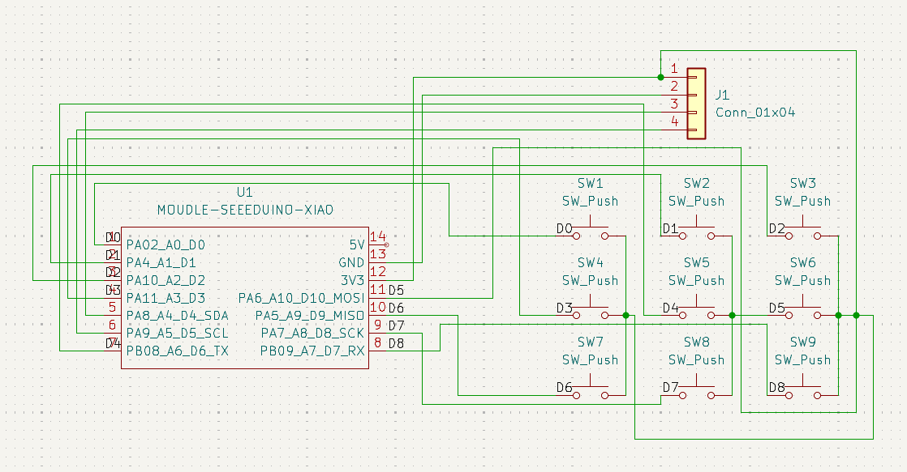

# Macropad

A custom 9-key macropad built from scratch using KiCad, featuring a Seeed Studio XIAO microcontroller and a 0.91" OLED display.

## ✨ Features

* 9 mechanical keys
* 0.91" OLED display
* Seeed Studio XIAO microcontroller
* USB-C connectivity
* Programmable keys for shortcuts, macros, and other functions
* Designed as a custom DIY hardware project

## 🪟 Screenshots of my Hackpad 
**My Overall Hackpad**

**Schematics**

**PCB Design**

**Connecting the Case and PCB**


## 💥Challenges 
During the entire design process, I did not face as many challenges as one would being a beginner to creating a Hackpad, before I started this project, I already had the basic understanding of how Fusion360 works, the only thing I needed to master and know are how to created the PCB and the firmware for my Hackpad to successfully function. In order to solve this issue, I went online; searched for tutorials, asked my friend who has a deep sense of love in coding and programming; through these resources, I was able to fully finish designing my Hackpad. For beginners reading this, I believe that you are able to make one too, just like I did!!! 

## 🔧 Hardware

| Component               | Quantity |
| ----------------------- | -------: |
| Seeed Studio XIAO       |        1 |
| Mechanical key switches |        9 |
| Keycaps                 |        9 |
| 0.91" OLED display      |        1 |
| Custom PCB              |        1 |
| USB-C connection        |        1 |

### OLED Display

The OLED uses a 4-pin connection with the following pin order:

| OLED Pin | Connection   |
| -------- | ------------ |
| GND      | GND          |
| VCC      | 3.3V / VCC   |
| SCL      | XIAO I²C SCL |
| SDA      | XIAO I²C SDA |

## 📐 PCB Design

The PCB was designed using **KiCad**.

The repository contains the KiCad project files, including:

* Schematic
* PCB layout
* Footprints
* Symbols
* Project configuration

The PCB is designed specifically around the components used in this project, so make sure the correct footprints and pin assignments are used before manufacturing.

## 📁 Repository Structure

```text
macropad/
├── README.md
├── PCB/
│   ├── macropad.kicad_pro
│   ├── macropad.kicad_sch
│   ├── macropad.kicad_pcb
├── CAD files/
│   ├─ base
│   ├─ plate 
├── images/
└── LICENSE
```

## 🚀 Firmware

The firmware will control the macropad's keys and OLED display.

Planned functionality includes:

* Custom key mappings
* Keyboard shortcuts
* Macro support
* OLED status display
* Future customizable profiles

## 🧪 Development

This project is currently under development.

### Current Progress

* [x] Select microcontroller
* [x] Select OLED display
* [x] Design initial schematic
* [x] Design PCB
* [x] Finalize PCB
* [x] design Macropad CAD model
* [ ] Manufacture PCB
* [ ] Assemble macropad
* [ ] Write firmware
* [ ] Test all keys
* [ ] Test OLED
* [ ] Complete final build

## 🛠️ Tools

* [KiCad](https://www.kicad.org/) — PCB and schematic design
* Arduino / PlatformIO — Firmware development
* GitHub — Version control and project documentation

## 📜 License

This project is open source. See the `LICENSE` file for details.

## 🙌 Credits

Designed and built by **JH** as a personal hardware and electronics project.

---

⭐ If you find this project interesting, feel free to star the repository!

